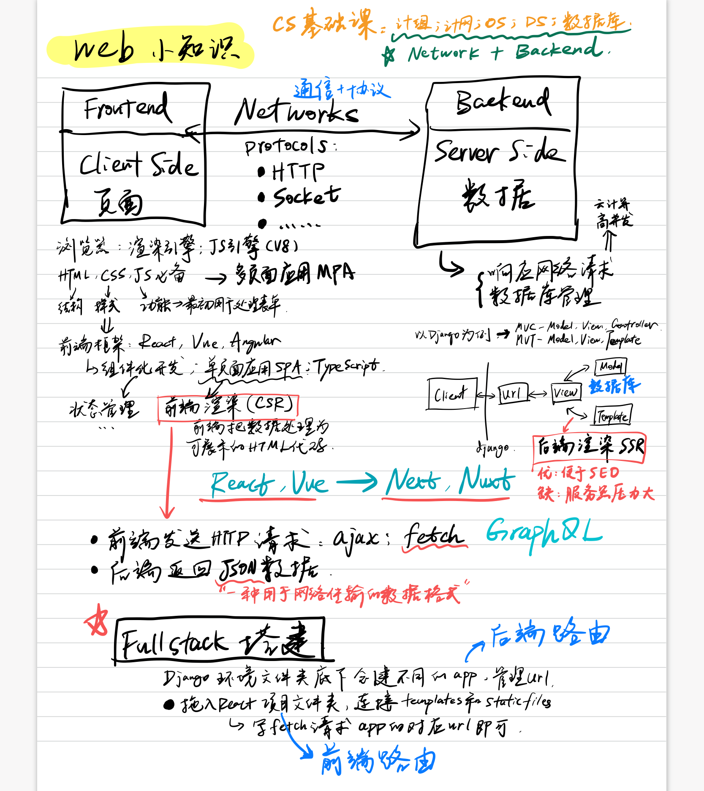

> 致CS Major的大学四年，这里是我所有困惑的答案~ 
> 感谢豆沙盒子团队的伙伴们，以第15届全国大学生软件创新大赛第五名作为大学四年的收官之作，我相当满意。这是我参与创作的第一个完整的软件项目，整个创作过程也解答了我对CS的所有困惑，而这也是我认为的对本科CS Major该有的一个交代。 :)

# Big Picture for Web/Dev
感到迷惑的前端（frontend）、后端（backend）、全栈（full stack）等词语及一些对应的知名框架，它们的位置都在下面的这张图里了~
- 爬虫爬的就是网络资源，因此对的前后端、网络协议也需要有认知
- 前端写页面其实并不low，各种图形学、算法、架构等知识一上来也难搞哦~
- 后端最主要面临的是前端大量请求给到服务器的压力
- 网络就是要了解协议，这是前后端通信的基本共识

[关于一些技术的Roadmaps](https://github.com/kamranahmedse/developer-roadmap)

## 前端 Frontend
页面的展示部分
### 前端框架
知名的CSR（Client-Side Rendering）及其对应SSR（Server-Side Rendering）框架

|CSR|SSR|
|:--:|:--:|
|React|Next.js|
|Vue|Nuxt.js|
|Angular|Angular Universal|

### 打包工具
webpack, gulp, rollup, parcel, Vite

### 状态管理 State Management
Redux, Vuex

### 前端路由 Routing
react-router, vue-router

## 后端 Backend
处理数据、网络请求等

### 后端框架
[一个参考链接](https://blog.back4app.com/backend-frameworks/)
知名框架及其对应语言，这些框架大都遵循MVC架构：

|语言|框架|
|:--:|:--:|
|Python|Django, Flask|
|Java|Spring Boot|
|C#|Asp .NET|
|NodeJS|ExpressJS, Koa|
|Ruby|Ruby on Rails|
|PHP|Laravel, CakePHP|

### 数据库
有代表性的数据库：
- 关系型数据库（Rational Database）：PostgreSQL, MySQL, MariaDB, MS SQL, Oracle
- 非关系型数据库（NoSQL）
    + Document: MongoDB, CouchDB
    + Column: DBs, Cassandra
    + Time Series: InfluxDB, TimescaleDB
    + Realtime: Firebase, RethinkDB

### 代理
Nginx, Apache

## 网络
- 协议：HTTP, Socket/WebSocket, TCP/IP
- 七层模型
- 浏览器输入url访问页面的基本过程

# 其他的开发
- Android：使用Android Studio，基于Java/Kotlin
- Windows：使用Visual Studio，基于C#
- ios/MacOS：使用Xcode，基于Swift
- 跨平台：electron、react-native、flutter、小程序、快应用等等，基于JavaScript
- 游戏：unity，基于C#

为什么说编程语言不重要，思想最重要？因为每种语言都有特定的应用场景，而把握好Domain Knowledge+基础算法则能自由切换上下文。此处没有提到的语言、平台和对应的工具和库还有很多，各自的应用场景也各不相同。

# CS专业课
- 基础课：微积分、线性代数、概率论与数理统计、大学物理
- 专业基础课：数据结构与算法、计算机组成原理、计算机网络、操作系统、数据库、面向对象编程
    + CS的通识性知识，大都对应于Big Picture中的后端部分
- 其余专业课：编译原理、体系结构、嵌入式、软件工程、机器学习、深度学习、计算机图形学
    + 通识性+专业性，涉及一定的Domain Knowledge

## Coding ≠ 开发 ≠ CS
对于计算机来说，开发再往上一定需要其他的Domain Knowledge，而精通Domain Knowledge的人不一定需要会开发。
- 计算机图形学干的就是用计算机模拟的事情，需要较好的数学、物理、材料等等的Domain Knowledge与基本的coding能力
- 机器学习/深度学习就是从数学（统计学、运筹学等）中来的，对于CS Major来说也算是Domain Knowledge
- 同时，对于其他专业，学习这个Domain上的coding一定是有帮助的，但是这**不等于开发**，更**不等于CS**

## Conclusion
**Coding = Simulation = Model + Calculation = Domain Knowledge + Math**
或许最好的安排是大学前搞定Coding开发的部分，大学深入Domain Knowledge，Phd/MS时开始创世~ 或许“喜欢计算机”这句话本身就是一个谎言。

> 只有真正的大师才能讲好基础课，对于所谓的前沿类知识，能讲的人其实很多。 ——写给自己