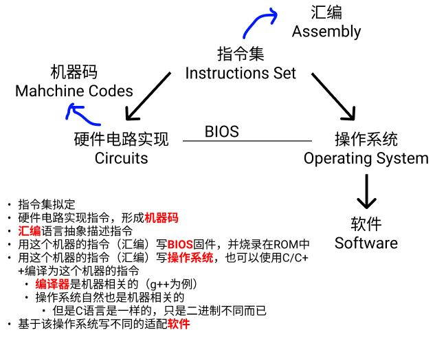
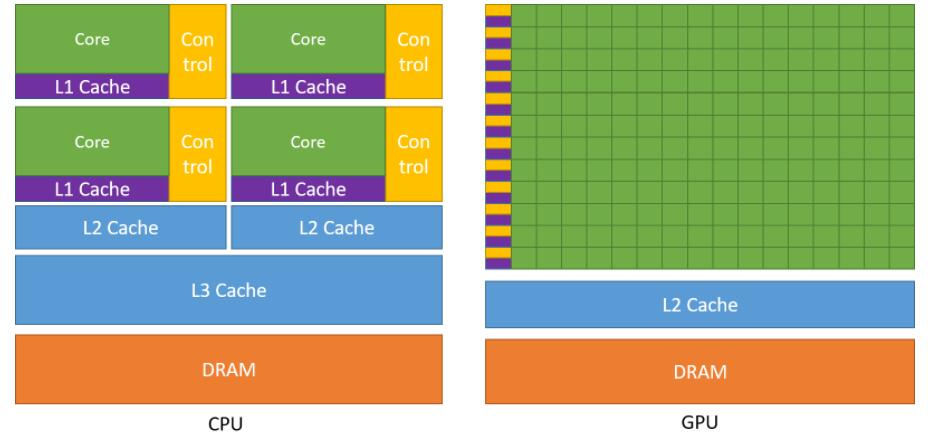
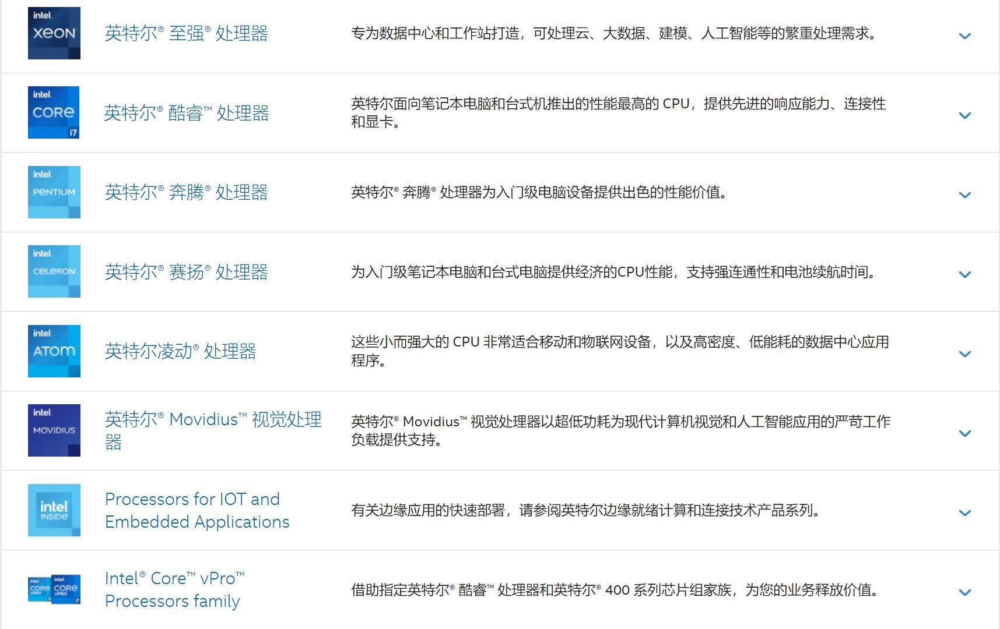
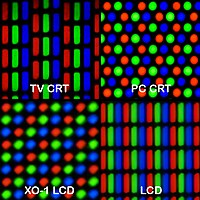
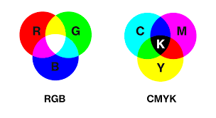

为了装一台自己的主机形式个人PC，需要对硬件设备进行彻底了解。同时，学计组、体系结构、操作系统等还是得知道到底是组了个什么东西、干了些什么实际的事情，别当电脑盲。

本文综合了文本、视频等各种网络资料，结合部分cs课堂内容，从practice层面叙述了整个计算机系统。

# 0 计算机基本

包含硬件（Hardware）、固件（Firmware）、软件（Software）
- [三者的区别](https://baijiahao.baidu.com/s?id=1717199035433133685&wfr=spider&for=pc)
- [固件和驱动](https://blog.csdn.net/qq_36412715/article/details/84105410?spm=1001.2101.3001.6661.1&utm_medium=distribute.pc_relevant_t0.none-task-blog-2%7Edefault%7EBlogCommendFromBaidu%7ERate-1-84105410-blog-113184237.pc_relevant_vip_default&depth_1-utm_source=distribute.pc_relevant_t0.none-task-blog-2%7Edefault%7EBlogCommendFromBaidu%7ERate-1-84105410-blog-113184237.pc_relevant_vip_default&utm_relevant_index=1)

> 本文主要集中于硬件部分知识，涉及少许固件、软件部分。并且，本文并不深入介绍原理，只肤浅地从看得见、摸得着的硬件设备出发进行介绍，什么多核、并行的，也是从实践角度触发感知。一些深入的书籍：
> - 唐朔飞 计组
> - 袁春风 计算机系统基础
> - cmu 深入理解计算机系统
> - 《计算机组成与设计：硬件 / 软件接口》
> - 编码的奥秘
> - 《计算机是怎样跑起来的》
> - 《程序是怎样跑起来的》

## 0.1 硬件 Hardware
硬件是指计算机系统中由电子，机械和光电元件等组成的各种物理装置的总称。这些物理装置按系统结构的要求构成一个有机整体为计算机软件运行提供物质基础。

### 自己装一台主机的基本组成部分
- 主板 Motherboard
- 中央处理器 CPU（Central Processing Unit）
- 内存 Memory
- 硬盘
    + 固态硬盘 SSD（Solid State Disk 或 Solid State Drive）
    + 机械硬盘 HDD（Hard Disk Drive）
        * 是可以没有SSD的，但是因为HDD速度慢，所以系统盘一般都要SSD
- 电源 Power Supply/Source
- GPU（Graphics Processing Unit）
    + 显卡（Video card 或 Graphics card）：核心部分是GPU
    + 集显：与CPU一同封装的GPU
- 散热 Coolers
    + 风冷 Air Coolers
    + 水冷 Liquid Coolers
- 机箱 Cases

### 其他硬件外设 peripherals
> 造成部分认知的冲突，是现在的主板、CPU等集成度越来越高，导致一些原本的“外设”都装进去了，同时GPU本身被CPU控制又与CPU有类似结构。
> 
> 这一块主要还是参考教材的论述，还是按冯诺依曼的部件区分：
> - 《计组》——唐朔飞，第9页：CPU和主存合称为主机，IO可称为外部设备
> - 《计组》——唐朔飞，第5章I/O
> 
> 参考[wikipedia: computer](https://en.wikipedia.org/wiki/Computer)，显卡、声卡等等，它就是外设！

- 机箱内部的，主机都不是外设
    + CPU和主板、内存、电源 不是外设
    + 散热既不是外设，也不是内设，它就不是计算机的一个部分
- 通过主板IO接口连接的输入输出设备，都是外设
    + 鼠标、键盘、显示器、摄像头
    + 光盘、u盘、硬盘等外存
    + 打印机、扫描仪
    + 调制解调器等
    + 网卡、声卡、显卡 都是外设
        * 声卡显卡是输出，网卡属于双工

### 服务器（企业级）
[百度百科](https://baike.baidu.com/item/%E6%9C%8D%E5%8A%A1%E5%99%A8/100571?fr=aladdin)

> 简而言之，一般通过网络，为用户提供更丰富、复杂的服务。比如多块CPU、多块GPU的算力支持，而个人PC一般是默认单GPU，但是本质上服务器与普通计算机的结构相差不大。

## 0.2 固件 Firmware
[from. 百度百科](https://baike.baidu.com/item/%E5%9B%BA%E4%BB%B6/627829?fr=aladdin)：

固件是指设备内部保存的设备“驱动程序”，通过固件，操作系统才能按照标准的设备驱动实现特定机器的运行动作，比如光驱、刻录机等都有内部固件。

固件是担任着一个系统最基础最底层工作的软件。而在硬件设备中，固件就是硬件设备的灵魂，因为一些硬件设备除了固件以外没有其它软件组成，因此固件也就决定着硬件设备的功能及性能。

> 是直接运行在硬件上的，一般写在非易失性存储器中，例如ROM、EPROM、EEPROM。[wikipedia-firmware](https://en.wikipedia.org/wiki/Firmware)

### 实例
- 主板的 Bios（Basic Input/Output System）
    + 为硬件烧录固件，固件也属于编程范围
- 键盘等的硬件都会有固件部分

## 0.3 软件 Software
在硬件、固件之上
- 系统软件 System Software
    + 操作系统 Operating System
    + 数据库 Database
    + 驱动 Drivers
        * 让os联系硬件，并且让硬件知道自己该干嘛
        * OS里都会预装很多的*兼容驱动*，大部分硬件比如常用的鼠标、键盘等都能直接用。以windows为例，打开`C:\Windows\System32\drivers`
        * *适配驱动*：主板驱动、外设驱动
- 应用软件 Application Software

## 0.4 逻辑总结
1. 指令集是预先拟定的，各个模块的硬件电路0/1（机器语言）负责实现这个指令集，并抽象成人类能理解的汇编语言
    + 汇编语言是机器相关的
    + 计算机的本质就是存储器存储这些码，然后一条一条读取、执行
    + 每一个硬件的接口，一定有对应的指令可以用~
2. bios预先烧录在主板上的固件，操作系统是建立在此基础上的软件
    + 开机一定是bios最先启动，它负责装载操作系统（引导之类的）。boot启动
    + 早期操作系统就是汇编写的（机器相关的代码），后期有了C语言等高级语言，开始了正向的迭代发展。同理，bios怎么写的？答：机器码（汇编）控制硬件及接口。
    + 操作系统是硬件相关的（指令集），一般是不同的芯片就不会略有不同
3. g++/gcc能将C/C++代码编译成汇编语言，由汇编器转为机器语言，再由链接器链接代码
    + 编译器是操作系统相关的，也就是机器相关的。C语言写出来的程序，无法“二进制跨平台”，但是语言本身是一致的
    + 早期的编译器由操作系统提供，后来就变成自己去下载
    + 所谓“机器无关”的语言，比如Java等解释型都有自己的解释器，不过这玩意儿也是操作系统相关的
4. 显示器看到的图形化东西属于外设的范畴，可以单独进行了解
5. 一条指令的执行速度？时钟周期？

### 硬件不同
- 意味着二进制、机器码不同
- 意味着汇编代码不同
- 意味着操作系统方法的实现不同
- 意味着不同操作系统的所有都不同

换言之，表面看上去的“相同”，比如所谓的平台无关，核心都是有关的。只不过因为封装了底层的东西，人只能操作表层抽象出来的“相同”的东西，所以无关，但同时也就带来了“效率”问题。

而在一个新的硬件平台上进行开发，想用“高级”语言，一定有硬件厂商提供的外部工具。比如switch、苹果电脑、VR头显等设备，一定有开发的接口，甚至这些设备还可能有自己的操作系统。

## 0.5 关于一些其他问题的博客
- [计算机是如何启动的？ ——阮一峰](https://www.ruanyifeng.com/blog/2013/02/booting.html)
- [按下开机键后，电脑都干了些什么？ ——知乎](https://www.zhihu.com/question/22364502)
- [处理器架构、指令集和汇编语言，三者有何关系？ ——知乎](https://www.zhihu.com/question/23474438)
    + [操作系统与CPU的指令集的关系是怎样的？](https://blog.csdn.net/a351945755/article/details/21536789)
        * LINUX：各种CPU架构都可以跑
        * WINDOWS： 只支持X86指令集， WINDOWS RT只支持ARM指令集
    + [M1是怎么兼容x86的？MacBook是否会有软件兼容性问题？](https://zhuanlan.zhihu.com/p/388277841)
- [LCD显示器](https://www.quora.com/What-are-pixels-in-an-LCD-screen-made-up-of-and-how-do-they-change-their-colors-according-to-the-color-of-the-image-displayed-in-the-LCD-screen)
    + [what does a pixel look like](https://www.google.com/search?newwindow=1&sxsrf=ALiCzsbaFdrsFMbASwWvA0XAbphOsbadfg:1660252214935&source=univ&tbm=isch&q=what+does+a+pixel+look+like&fir=sgU5yi-Pr6QK5M%252CQ80AI9lS3M5HcM%252C_%253BQZpiS0KLmy37dM%252CCch7gGGQHE8OlM%252C_%253BPKoZDYVDhdgkPM%252CQ80AI9lS3M5HcM%252C_%253Bguf2cIuoJTzbAM%252ChIEFnLBb8g3CSM%252C_%253BzIS9CCdJ1ayCaM%252ClkTP2co5EaaDAM%252C_%253BmqOUa1fXKxtzBM%252CCch7gGGQHE8OlM%252C_%253B_Zu0lY1B2pQf2M%252CNvbp6YVp2mqBHM%252C_%253BFp7DwNTdqe2pbM%252CYwwNMkmBhyChnM%252C_%253BVVD8JD_uTsLZWM%252CbLBqTCOE1nbyDM%252C_%253BZ1WkXn6z-whHsM%252CC7s-t4wCLieWKM%252C_%253BWwwMjpmaNKf7vM%252ClYidAKugRMzm5M%252C_%253BzZyIRfJ8uF8O-M%252CKhjH19KERiR4bM%252C_&usg=AI4_-kS3za-Bqnj_wdpkx2lnJLLYFl7Lbw&sa=X&ved=2ahUKEwi03Yi82b_5AhX1SGwGHfszD_8Q7Al6BAgCEE4&biw=1280&bih=577&dpr=1.5)
    + [How pixels work](https://www.youtube.com/watch?v=0B79dGR19Tg)
    + [LCD如何实现彩色显示](http://www.hxdtekf.com/article/1031.html)
    + [液晶显示器的背光源](https://www.dragonlcm.com/18851.html)
- [单片机、CPU、指令集和操作系统的关系](http://t.zoukankan.com/xinfengzi-p-5967458.html)
    + 想进一步理解深层次原理，得从单片机开始。用单片机理解计算机系统。
- [switch有操作系统吗？](https://www.zhihu.com/question/61813935/answer/1743640352)
    + 有。甚至steam出的steam deck，能跑steamOS也能跑windows10
- 存储器是如何存储的？——锁存器
    + 固件是如何被烧录的？
    + 操作系统如何运行在主板上？
- 无线信号如蓝牙、wifi等是如何传输并接收的？
- 电源是如何工作的？传感器等又是如何制造的？

### 解答上述问题需要学习的内容（本文不深入）
- 数字电路/模拟电路
- 计算机组成与原理
- 操作系统
- 体系结构
- 微机原理
- 通信原理：无线、微波等

> 电子信息和通信的部分可以慢慢看，当个兴趣爱好就行。对自己的定位仍然是cg.

# 1 主板 Motherboard
> - 重点参考：[wikipedia](https://en.wikipedia.org/wiki/Motherboard)
> - [百度百科](https://baike.baidu.com/item/%E4%B8%BB%E6%9D%BF/104636?fr=aladdin)
> - [一个YouTube视频](https://www.youtube.com/watch?v=b2pd3Y6aBag)
> - [知乎文章](https://zhuanlan.zhihu.com/p/449507475)

一些名词，也是主板的组成部分：
- cpu socket
- memory slots
- bus slots：显卡、声卡、网卡都在这里安装
- SATA connecters
- M.2 slot
- modern: platform controller hub
- old: chipset
    + 北桥 north bridge：链接cpu、ram、bus
    + 南桥 south bridge
- IO interfaces
    + USB（Universal Serial Bus）
    + Type-C（USB Type-C）
    + Video Adapter
        * Integrated Video
        * DVI
        * VGA
        * HDMI
        * DisplayPort
    + network interface card：以太网RJ-45
    + integrated sound card
- PSC (Power Supply Connector)
- ATX, microATX
- Printed Circuit Board (PCB) 印制电路板

## 1.1 主板基础结构
（等我买主板了，拍个照片标注一下放在这里~

现代的计算机主板一般包括：
- CPU插槽 CPU sockets/slots
    + 一般购买是 板+u 配套
- 内存插槽 memory slots：主存安装的地方
    + 通常以包含DRAM芯片的DIMM模式，DDR3、DDR4、DDR5或者板载LPDDRx
- 芯片组 chipset
    + 形成CPU、主存、外设总线的接口
- 非易失性存储芯片 Non-volatile memory chips
    + ROM, EPROM, EEPROM, NOR flash
    + 存储了系统的固件，bios。初始化硬件设备、加载操作系统
- 时钟发生器 clock generator
- 电源连接口
- 扩展卡插槽 slots for expansion cards
- 硬盘的连接器
    + SATA、NVMe
- 其他：USB等

### 细节
#### PCIe
PCIe (Peripheral Component Interconnect Express) 是一种高速串行计算机扩展总线标准
- [PCIe百度百科](https://baike.baidu.com/item/PCIE)
- [PCIe wikipedia](https://en.wikipedia.org/wiki/PCI_Express)
- [深入了解PCI/PCIe](https://zhuanlan.zhihu.com/p/26172972)

各种“卡”，都需要插在这个接口上。作为扩展接口，它主要用于外围设备的连接和扩展。

pcie插槽只有最长的两根才能接显卡。其他短的基本是用来接无线网卡、蓝牙、声卡、采集卡等设备。主板越高端、pcie插槽越多、代表主板的扩展性越丰富。e-atx主板就能插很多。

> 总线插槽 bus slots

#### 芯片组 chipset
截止到2022.8.12的主板产品分类（芯片组栏）intel：
- Z690
- B660：intel 12代
- B550
- H610
- H510
- X570

> 两个平台，都有X和B，要注意适配的cpu
> - intel：H代表低端主板，B代表中端主板，Z代表高端主板
>     + 6是第12代酷睿芯片
> - amd：X专业级或者发烧级，B：主流级，A：入门级

老式主板还有南桥和北桥，北桥芯片往往有较高的工作频率，所以发热量颇高南桥芯片主要决定主板的功能。如今北桥的功能逐渐被CPU所包含，自身结构不断简化甚至在芯片组中也已不复存在。
- 北桥 north bridge：很重要
    + 北桥芯片是系统控制芯片，主要负责CPU、内存、显卡（pcie直连cpu的通道）三者之间的数据交换，北桥芯片还与南桥芯片连接
- 南桥 south bridge
    + 主板上的各种外设接口、PCIE非直连cpu部分、硬盘，都归南桥芯片控制

## 1.2 板型 form factors
> sizes & shapes

现在一般是ATX，还有microATX，E-ATX，mini-ATX

## 1.3 品牌和产品
主板的几个品牌：
- 华硕 asus
    + 顶级：ROG（Republic of Gamers）
        * ROG STRIX：旗舰高端玩家，对超频和扩展有追求
        * ROG 玩家国度：高性能炫彩
    + 中端（重炮手）：TUF GAMING 极致稳定
    + 入门：PRIME
- 微星 msi
    + 入门：PRO系列
    + 中端主流（迫击炮）：MAG系列 MSI Arsenal GAMING（微星 军火库 电竞）
    + 高端：MPG系列 MSI Performance GAMING（微星 性能 电竞）
    + 旗舰：MEG系列 MSI Enthusiast GAMING（微星 狂热 电竞）
- 技嘉 gigabyte
    + AORUS
    + AERO
    + GAMING
    + ULTRA DURABLE

> 旗舰 flagship：旗舰机的意思是该品牌目前最高端，最能吸引人目光的型号。

## 1.4 其他相关内容
- [How do PCBs work?](https://www.youtube.com/watch?v=H9pGbLJknDk)
    + PCB和集成电路不同，PCB只有“连线”，没有元器件；而集成电路是有元器件的。PCB是印刷出来的
- [How CPUs Are Made As Fast As Possible?](https://www.youtube.com/watch?v=N7ut61pSLwk)
- [电脑开机：如何比别人更快！？](https://www.youtube.com/watch?v=m8_vdYJEnm8)
    1. 电源供电，主板稳压
    2. UEFI（新）/BIOS（老）
        * bios会开机自检，uefi不会所以更快
    3. 启动引导，找到硬盘，启动操作系统
    4. 选择系统（多个的情况），加载操作系统
        * 初始化，os核心从硬盘加载到内存
        * 控制权交给os
- [南桥芯片组](https://www.youtube.com/watch?v=8JpLPenK5v0&list=PLdid8P_6RNJqVr9RcBt_IPpa4Wz7EtB8c&index=6)

# 2 CPU & GPU
- GPU是通过PCIE插槽连接在主板上的，只有长的才能接显卡，所以主板的PCIE限制了显卡的数量
- 多CPU、多GPU都需要主板的支持，貌似也只能装linux系统
    + [可以看这个关于linux的文](https://blog.csdn.net/qq_45172832/article/details/124396797)
    + 芯片是核心，主板是硬件服务实现的支持
    + 什么是超算？把计算机连接在一起，获得更强大计算能力，也就是一群计算机并行。

## 2.1 基础结构
> 根据教科书，CPU包括运算器和控制器
> - 考试：CPU只有ALU和CU
> - 实际应用里（如intel、nvidia等），也包含了部分存储结构，比如多级cache。甚至还会集成更多的东西，只不过核心就是ALU和CU

[NVIDIA官网： cuda toolkit documentation](https://docs.nvidia.com/cuda/cuda-c-programming-guide/index.html)

- 绿色：计算单元 ALU
- 蓝色和紫色：cache（高速缓存）
- 橙色：DRAM存储单元
- 黄色：控制单元 CU

根据这张图（来自NVIDIA cuda文档），可以明显看出GPU的计算单元非常夸张，控制单元和存储单元只有比较小的一部分。

> AMD有一款APU，集成了CPU和GPU，实现了CPU和GPU的真正融合（并不是普通的集显）

## 2.2 参数详解
cpu和gpu都有参数和自己的架构，最好的方式 ——官网。

### 1. CPU
[intel官网：i7-12700KF 处理器](https://www.intel.cn/content/www/cn/zh/products/sku/134595/intel-core-i712700kf-processor-25m-cache-up-to-5-00-ghz/specifications.html) 部分摘录如下：
- CPU规格
    + 主频
    + 内核数
        * 性能核（P-Core 大核）
        * 能效核（E-Core 小核）
    + 线程数
    + 最大睿频频率
    + 最大睿频功耗
    + 基本频率
    + 基础功耗
    + 高速缓存
        * 二级高速缓存总容量
- 内存支持
    + 内存类型
    + 内存通道数
    + 最大内存带宽
    + 最大内存容量
- 扩展选项
    + DMI通道最大数
    + PCIe通道数最大值
    + PCIe配置
- 封装规格
    + 支持的插槽
    + 散热
    + 大小
- 先进技术
    + 指令集、指令集扩展

#### 架构
- intel 12代CPU最新的大小核架构设计
- amd是zen架构，还有Bulldozer推土机架构

### 2. GPU
[NVIDIA官网-3090ti规格](https://www.nvidia.cn/geforce/graphics-cards/30-series/)
- NVIDIA Cuda Core核心数
- 加速频率
- 显存容量
- 显存类型

[技嘉官网-3090ti规格](https://www.gigabyte.cn/Graphics-Card/GV-N309TAORUSX-W-24GD/sp#sp)
- 显示核心
    + 核心频率
    + cuda数
    + 显存大小
    + 显存类型
- 显存位宽
- 总线标准
- 数字分辨率
- 多屏支持
- 显卡尺寸
- PCB尺寸
- DirectX
- OpenGL
- 建议电源
- 供电接口
- 输出接口
- SLI支持
- 水管长度
- Fan
- Radiator
- 配件

#### 架构
[GPU设备架构](https://blog.csdn.net/zhangfuliang123/article/details/112949058) 列举一些N卡近期的：
- Pascal架构（10系）
- 图灵架构 Turing（20系）
- 安培架构 Ampere（30系）

## 2.3 品牌和产品
### 1. CPU
主要有intel、amd，国产龙芯

Fun Fact：
- switch用的cpu处理器是NVIDIA的tegra处理器，gpu应该也是NVIDIA
    + [switch OLED拆解](https://www.bilibili.com/video/av208383980?vd_source=332380f37aa700dd26b5052355228b7b)
- steam deck用的是amd定制的APU处理器，APU就是集成了显卡的cpu
    + [文：steam deck拆解](https://baijiahao.baidu.com/s?id=1724373670592641504&wfr=spider&for=pc)

#### Intel
> [官网-处理器产品系列](https://www.intel.cn/content/www/cn/zh/products/overview.html)

可以看出，我们平时经常说的*i3,i5,i7,i9*都是酷睿Core系列，除此之外还有更多的处理器来应对不同的场景。

#### AMD
> [官网-处理器](https://www.amd.com/zh-hant/processors)

个人PC一般是锐龙*R3, R5, R7, R9*。跟intel一样，不同场景都有不同的处理器，大型工作站、笔记本电脑等等。

### 2. GPU
- gpu是显卡（Video Card）的核心部分，属于芯片处理器一类
- 可以查看*显卡天梯图*来判断性能

#### NVIDIA
> [30系GeForce官网](https://www.nvidia.cn/geforce/graphics-cards/30-series/)

目前显卡仍然是N卡为主流，尤其是cuda让N卡在深度学习领域占优势。
- GTX
- RTX，20系、30系（截至2022年8月）
    + 目前最好的是 3090ti

#### AMD
> [官网-gpu](https://www.amd.com/zh-hant/graphics)

桌上电脑型显卡：
- RX, R, ...
    + 目前最好的是RX 6950XT

### 3. 显卡 Video Card
- 显卡
    + 公版显卡：一般在公布芯片的同时会做一个显卡
    + 非公版显卡：购买芯片，其他厂家加工
- 一般市面上买到的都是非公版显卡，并且一般都比公版好

#### 常见的品牌
- 一线：华硕，微星，技嘉，蓝宝石，迪兰
- 准一线：七彩虹，索泰，影驰
- 二线：耕升，铭瑄，讯景

> 华硕这些太贵，基本往七彩虹、影驰、技嘉这种买就行。

## 2.4 其他相关内容
- [为什么intel不制造独立显卡？](https://zhidao.baidu.com/question/1644911328317143540.html)
- [How CPUs Are Made As Fast As Possible](https://www.youtube.com/watch?v=N7ut61pSLwk)
    + CPU是从沙子开始生产的，生产的工具叫光刻机
    + intel，amd，台积电，三星，等cpu的制造技术与半导体
    + huawei等与通信、操作系统、CPU等，甚至是与台积电
- [CPU散片和盒装](https://www.youtube.com/watch?v=tq62FTYuZ8M&list=PL7mmImi_1wpMVhVpBWr3Bob7kdchdDEoX&index=1)
- [NVIDIA NVLink](https://www.youtube.com/watch?v=RBf8FLS6q8E)
    + 这个突破了pcie，是NVDIA自己的总线协议，就用于搞多个显卡
- [2个amd霄龙，10个3090装一台电脑，linux系统](https://www.bilibili.com/video/BV16r4y1N7Sk/?spm_id_from=333.788.recommend_more_video.-1&vd_source=332380f37aa700dd26b5052355228b7b)
    + 多cpu、多gpu，多核、并行等技术
- 了解一下总线/各种协议的具体内容，能更理解硬件
    + USB、Type-C等等，都是协议的接口
    + 包括HDMI、VGA、VGI等音视频传输协议
    + 蓝牙、NFC等无线，都有对应的协议
- [百度百科-指令集](https://baike.baidu.com/item/%E6%8C%87%E4%BB%A4%E9%9B%86/238130)
    + 每一种新型的CPU在设计时就规定了一系列与其他硬件电路相配合的指令系统
- [CPU科普](https://zhuanlan.zhihu.com/p/127943732)
- [Intel Technology: Architecture All Access](https://www.youtube.com/watch?v=vgPFzblBh7w&list=PL8t1FdN2Tj3ZVAzTY-FvsS0qy-mEfRdoj)

> 这样就更能看出，operators -> 操作电子元器件级别的人，包括cpu各种控制；operating system -> 帮我们操作了这些东西。

# 3 内存 Memory
> 存储器分类：[此文比较详细](https://blog.csdn.net/as480133937/article/details/123455890)
> - 易失性存储器：RAM
> - 非易失性存储器（non-volatile memory）
>     + ROM
>     + FLASH
>     + 光盘、软盘、硬盘等
> 
> 本节主要涉及RAM和ROM，下一节涉及硬盘。

|项目|RAM|ROM|
|:--|:--|:--|
|全称|随机存取存储器  Random Access Memory|只读存储器  Read Only Memory|
|简介|掉电丢失数据|系统掉电仍能保持数据|
|子分类|1. 静态RAM-SRAM (Static RAM)：只要有电就保持数据，一般作为CPU的cache   2. 动态RAM-DRAM (Dynamic RAM)：需要不断刷新保持数据，分为同步SDRAM和异步。一般作电脑内存|1. 固定内容ROM   2. 可一次编程PROM  3. 可擦除ROM：紫外线擦除电写入EPROM、电擦除电写入EEPROM|
|实际|同步DRAM-SDRAM (Synchronous DRAM)：装机用的DDR的全称为**双倍速率同步动态随机存储器**(Dual Data Rate SDRAM)|ROM都在主板上，存了BIOS|

- ddr5比ddr4性能更好，但是价格也更高
- 目前主板上的ROM都是FLASH，也就是一种可快速读写的EEPROM
- 存储器，速度倒序，容量正序总结：
    + 寄存器
    + SRAM - cpu的cache
    + DRAM - 外面的内存条，一般是同步的SDRAM
    + FLASH - 主板上存BIOS的ROM。固态硬盘也是Flash芯片

## 3.1 参数
- 容量
- 内存频率

## 3.2 品牌和产品
- 金士顿
- 海盗船
- 英睿达
- 威刚
- 铠侠（也即是东芝）

## 3.3 其他相关内容
- [what is dram?](https://www.youtube.com/watch?v=Lozf9sceW_o)
- [内存条科普](https://zhuanlan.zhihu.com/p/129784673)
- 存储器的基本原理：锁存器 Latch

# 4 硬盘 Hard Disk
曾经，
- 硬盘：存数据
- 软盘：运数据
    + 现在被U盘、移动硬盘替代
- 光盘

## 4.1 基本分类及相应参数
- 机械硬盘 HDD：盘片和磁头，高速旋转读取
    + 接口
        * SATA接口
    + 转速
    + 容量
    + 缓存
- 固态硬盘 SSD：闪存芯片的阵列式，没有机械设备
    + 接口
        * SATA接口
        * M.2 (AHCI协议)：也被叫做M.2（SATA总线），走的还是SATA的通道，所以交换带宽极限依然是SATA3.0的
        * M.2 (NVMe协议)：真正意义上的高速固态硬盘，走PCIe通道，能突破SATA3.0的极限，而且PCIe通道直连CPU，几乎没有延迟
    + 闪存类型
    + 容量
    + 缓存
    + 颗粒

## 4.2 品牌和产品
- 三星
- 西部数据
- 铠侠（东芝）
- 镁光

## 4.3 其他相关内容
- [硬盘数据恢复的原理](https://www.youtube.com/watch?v=UK6x-6H2XBQ)
    + 删除并不会真的清除磁盘，而是代表这个文件的磁盘位置可以被重写。新文件可以写在这里，覆盖这一块磁盘位置。所以，在没有被覆盖的时候，都是能恢复的。*文件粉碎*就不可被恢复，原理就是写一些别的东西到同样的位置。
    + trim优化，会定时清除固态硬盘上被删除的数据，保证了硬盘的性能
- [windows如何看到硬盘扇区和磁道等](https://jingyan.baidu.com/article/bad08e1e823d8748c85121fb.html)
    + windows环境下，安装winhex能看到磁盘地址及内容
- [硬盘科普](https://zhuanlan.zhihu.com/p/135430984)
- [固态硬盘为什么比机械硬盘快？快在哪里？快的这些地方影响什么体验？](https://www.youtube.com/watch?v=lGAiNZYMAWY&list=PLdid8P_6RNJqVr9RcBt_IPpa4Wz7EtB8c&index=7)

# 5 Monitor & GPU
显示器是通过接口（HDMI、VGA、DVI等）与GPU相连的。

显示器基础分类：
- 液晶显示器 LCD
- 有机发光半导体 OLED
- CRT太老了，已经是过去式了

以下一组RGB均为一个像素：

[显示器的混色方法](https://zhidao.baidu.com/question/1375303818491053619.html)：
- 相加混色
    + 空间混色，3个很近，人眼自己产生光的混合
    + 时间混色（刷新），靠人的生理原理
- 相减混色

> 我的疑问：为什么都是rgb排布，而人眼不会把两个像素的gbr或者brg混在一起？同时手机那样的像素点排布，为什么还能实现因为距离近产生的混合的效果？

## 5.1 参数
- 尺寸：英寸 inch
    + 21/24/27等，都是屏幕对角线的长度
- 分辨率：
    + e.g. 经典的宽高比16:9的1080p显示器：即1920\*1080，指宽\*高各有多少个像素点。1080p即可指代分辨率。
- PPI：Pixels Per Inch
    + 显示器的PPI衡量：对角线上有多少个像素点，除以尺寸
        * `PPI(27寸1080p) = sqrt(1080**2 + 1920**2) / 27 = 82` 
- 最佳观看距离
    + iPhone4的发布会中，乔老爷子提出了一个概念：*视网膜屏幕*。它的定义是“PPI300以上屏幕在10英寸（25.4厘米）外观看时，人眼不会察觉到像素点的存在，屏幕显示效果就十分细腻，图像细节也会很丰富。
        * 换句话说，10inch以内观看，ppi300以上感觉最好
        * 27英寸屏幕最佳观看距离是70cm，也就是说，需要到ppi107最好
- 常用接口：HDMI、VGA、DVI
    + 一般会从GPU接，用集显就接在主板上，用独显就接在显卡上

通常选购的搭配，符合*视网膜屏幕*标准的搭配：
- 1080p下，21.5inch以下
- 2k下，27inch以下
- 4k下，41inch以下

### 其他参数
- 刷新率：xxx hz。电子束对屏幕上的图像重复扫描的次数，每秒重复xxx周。是显示器的参数，为常量。
    + **FPS**：frame per second。这是**显卡/GPU**每秒输出的帧数，是一个变量。
    + 对于144hz的刷新率，和144fps：
        * 一秒刷新144周 - 一秒产出144帧：刚好相互对上，一帧即刷新一周展示
    + 对于144hz的刷新率，和60fps：
        * 一秒刷新144周 - 一秒产出60帧：一帧刷新 `1/60*144` 周。属于显卡跟不上显示器，但是没有多大问题，因为也可能是每帧变化不大。
    + 对于144hz的刷新率，和200fps：
        * 会适当舍弃几帧不展示，属于显示器跟不上显卡了
- 色域：能展示颜色的多少
- 面板类型：IPS、TN、VA
- HDR：高动态范围成像
- 护眼...

### 5.2 颜色
- 三基色（光学三原色）：RGB，红绿蓝
    + **自己发光**的东西（e.g. 电子屏幕），`红光+绿光+蓝光=白光`（加色原理）
    + 红光的互补光色是：`白光-红光 = 绿光+蓝光 = 青光`
    + 绿光的互补光色是：`白光-绿光 = 红光+蓝光 = 品光`
    + 蓝光的互补光色是：`白光-蓝光 = 红光+绿光 = 黄光`
- 三原色（颜料、印刷）：CMYK（青色、品红、黄色 -> 红黄蓝，黑色）
    + 自己不会发光，物体的颜色取决于反射的光色，也就是 `反射光色 = 白光 - 吸收光色`
    + 颜料青色，相当于反射青色、吸收了红色，即`青光 = 白光-红光`。其余颜色反之亦然。
    + 如果用`青色颜料+黄色颜料`，结果是绿色。因为`青=白-红, 黄=白-蓝`，于是有`青+黄 = 白-红-蓝 = 绿`。这就叫减色，看CMYK图，一定要脑子里有互补色，然后白色-互补色。

## 5.3 其他相关内容
- [显示原理](https://zhuanlan.zhihu.com/p/336924730)
- [How do touchscreens work?](https://www.youtube.com/watch?v=WdS4JU17HRs)
- [显示器科普](https://baijiahao.baidu.com/s?id=1671234130825839425&wfr=spider&for=pc)
- [LCD基础知识（包含电路）](https://blog.csdn.net/m0_37845735/article/details/124540586)
- [LCD编程显示像素点](https://gq-zeng.blog.csdn.net/article/details/103205833?spm=1001.2101.3001.6650.1&utm_medium=distribute.pc_relevant.none-task-blog-2%7Edefault%7EBlogCommendFromBaidu%7ERate-1-103205833-blog-124540586.pc_relevant_vip_default&depth_1-utm_source=distribute.pc_relevant.none-task-blog-2%7Edefault%7EBlogCommendFromBaidu%7ERate-1-103205833-blog-124540586.pc_relevant_vip_default&utm_relevant_index=2)
    + 主板连接显示器，cpu控制输出信号，显示器展示内容。这是通过连接的接口，cpu控制读写的，需要了解接口和控制的原理。
- [LED和OLED](https://www.youtube.com/watch?v=gZriQjtABCk&list=PLdid8P_6RNJqVr9RcBt_IPpa4Wz7EtB8c&index=7)
- [Monitors Explained - LCD, LED, OLED, CRT, TN, IPS, VA](https://www.youtube.com/watch?v=yxygknX1AiE)

# 6 电源、散热、机箱
- 电源功耗很重要
- 散热不好会导致降频，从而让硬件性能无法完全释放
- 机箱：机箱构造对散热有影响

## 6.1 基本介绍及参数
- 电源
    + 功率，必须满足GPU的最低要求
    + 模组
    + 认证
- 散热
    + 风冷
    + 水冷
- 机箱
    + 注意体积、机箱布局、主板和各个硬件的尺寸支持

## 6.2 其他相关内容
- [电脑散热器工作原理科普](https://www.youtube.com/watch?v=r1lLFOBqhZw)
- [电源 模组](https://www.youtube.com/watch?v=AixflQWXszY&list=PL7mmImi_1wpMVhVpBWr3Bob7kdchdDEoX&index=21)
- [电源 金牌/铜牌80PLUS认证](https://www.youtube.com/watch?v=EjBQ-di7zDQ)
- [2K为什么是1440p，4K为什么是2160p?](https://www.zhihu.com/question/345308612)

# 7 其他外设及接口等
## 7.1 操作系统
操作系统：
- 本质上是制定了**一系列的*操作*功能**，以便更好地**利用硬件设备**
    - 比如最初的工作排序，后来的处理器协调，等等，都是在做一个软件通用的适配平台，让硬件更好地被利用。
        - os功能：进程管理、存储管理、设备管理、文件管理、作业管理
    - 否则，所有程序都是“特例”，需要为平台单独写一串代码，也就是那条**纸带**
- 汇编语言写现代os是不大可能的，太复杂了。所以理论上说，实践过程中需要为平台先写好一个编译器，再用高级语言写复杂的操作系统。
- 果然，查阅资料发现，C语言与Unix操作系统息息相关，[wikipedia-C-history](https://en.wikipedia.org/wiki/C_(programming_language)#:~:text=C%20is%20an%20imperative%20procedural,all%20with%20minimal%20runtime%20support.)，摘录如下：
    - 最早，unix是Dennis Ritchie 和 Ken Thompson用汇编在PDP-7上写的，最终他们决定将它移植到PDP-11，也是用汇编写的
    - Thompson希望有一个新的语言利用好新平台。一开始尝试了写Fortran的编译器，但是放弃了，接连就开发了BCPL和B语言，但是B还是太慢了，并且不具备PDP-11的一些机器特性
    - 1971年，Ritchie开始改进B，命名为New B（NB），1972年，C语言诞生。在第二版本的Unix操作系统里，C语言编译器和一些特性被一同写入。
    - 第四版本的Unix在1973年发布，内核完全用C语言重写了。上述内容都是在贝尔实验室中诞生的
        - [这个博客总结得不错，甚至AT&T和Linux等都在了，甚至互联网也是伴随而来的](https://www.cnblogs.com/wangtao_20/p/4433744.html)

可执行文件：
- e.g. windows-.exe, Linux-ELF
- 也就是机器可以用这一个二进制文件**执行相应的操作**，与操作系统有关，它确定了需要硬件执行什么操作。可以用文本模式打开.exe文件，发现是一长串的十六进制机器码
    + 本质上，就是原来的那条被送进去跑的**纸带**，在这个操作系统下对应跑的内容（因为操作系统额外规定了一些必要的东西）

## 7.2 其他问题及科普
- [硬件科普系列](https://www.youtube.com/playlist?list=PL7mmImi_1wpMVhVpBWr3Bob7kdchdDEoX)
- [How does a Mouse know when you move it? || How Does a Computer Mouse Work?](https://www.youtube.com/watch?v=SAaESb4wTCM&list=PLdid8P_6RNJqVr9RcBt_IPpa4Wz7EtB8c&index=10)
    + 鼠标把信号传给cpu，还有的信息，操作系统可以指挥cpu需要用这些信息执行什么操作
- 接口的协议和编程等需要单独进行了解，以便更好地理解软件、硬件工作原理。本文不再详述，留下几个问题：
    + 接口的工作原理？如何对硬件接口编程，是固件还是驱动软件？
    + 外设如何通过接口输入/输出信号？
    + 鼠标、键盘等外设如何与显示器结合工作？比如，接口之间传输什么信息、怎么传，CPU又如何控制，又如何获取用户鼠标点击的位置和行为？
    + 耳机、音响、触摸屏的原理？
    + CPU和GPU之间的控制和接口的逻辑

# 8 关于测评和benchmark
一些测评的软件：
- 3Dmark、CineBench、aida64、asssdbenchmark、鲁大师等
- furmark 测试显卡
- 主流游戏测评机器：古墓丽影、荒野大镖客、赛博朋克、GTA等

# 9 第一次装机记录~
这才是真正意义上自己的第一台“电脑”

## 9.1 配置清单 (2022.8)
总价：7511（全京东自营店购买）
- 板U：2869
    + 微星迫击炮：MAG B660M MORTAR WIFI DDR4，板型M-ATX紧凑型
    + CPU：Intel 酷睿 i5-12600KF
- 内存：296
    + 金百达 16G(8G\*2)套装 DDR4 3600
- SSD：579
    + 铠侠 1T NVMe M.2接口
- 显卡：2899
    + 技嘉魔鹰 RTX3060 GAMING OC 12G
- CPU散热：159
    + 利民 PA120 SE 6热管双塔逆转
- 机箱风扇：59
    + 先马冰洞 3个12cm机箱散热风扇 无光
- 机箱：179
    + 爱国者 YOGO M2 白色
- 电源：469
    + 长城 额定650W 金牌全模组

> OMG！期待了很久，也做了超级多的工作，最后发现研究生宿舍太小根本放不下主机，只能忍痛退货了555，转战游戏本！

## 9.2 游戏本
选购游戏本，其实也就是高性能笔记本，上述内容本身也适用于各种“电脑”的选购。同时需要补充，配置在笔记本电脑上的CPU和GPU，都是专门为此类设备打造的。

我的需求：
- cpu：不低于12代i7，标压
- gpu：3060/3070，显存6g+
- 内存：16g+，ddr5最好，可以自己拓展
- ssd：512g+，可以自己拓展
- 散热要好，不要轻薄游戏本
- 尽可能选择一线品牌，预算1w+左右

> 我主要的功能需求：
> - 虚拟机
> - 简单的音视频编辑和图像处理（pr、ae、ps、ai、au...）
> - 做简单基础图形学，C++的开发支持，opengl等等
> - 能使用blender、unity、unreal engine，部分简单的游戏
> - python环境、前端代码
> - 其他简单的办公环境

### 游戏本品牌
- 一线：外星人、ROG、雷蛇
- 准一线：联想拯救者、戴尔游匣、华硕天选、惠普暗影精灵、宏碁暗影骑士擎
- 二线：机械革命、神舟、雷神

> 待定：合计10499左右，完全足够了
> - 联想拯救者 y9000p ￥9499
>     + 12代i7标压H
>     + gpu3060，6g显存，满血
>     + 内存16g ddr5 可加至32
>     + ssd512g，2个m.2接口 pcie4.0
>     + 散热不错
>     + 2.5k屏，16:10，窄边框还有摄像头
>     + 预装windows11
>     + 自己再加个1T固态，买三星980pro或者西数sn850就行 ￥999左右

**2022.8.19**：经本人研究发现，笔记本电脑因为是**整机**，又考虑到**使用年限**的问题（一般笔记本也就用个4-6年吧），在**没有直接性能需求**的情况下（比如一次性用满所有性能），根本没有必要买“顶配”、“旗舰”。选择满足当下需求的主流配置即可，比如现在对于我来说，选择可以拓展内存和硬盘的，cpu12代i7、gpu3060、内存16g+、固态512g+，这样就足够了。一来是4年+之后换电脑没有负罪感，二来是性能比刚刚好多一点就够这么些年用了。

一线品牌性价比仍然不高，对比之下rog枪神都算性价比高的了，但是它没有摄像头我还是不能忍；外星人纯纯的智商税、高颜值、好服务；戴尔游匣、华硕天选、惠普暗影精灵这些主流大众的，又或多或少有些奇奇怪怪的大小毛病；类似机械革命这种品牌，看上去性价比是高了，但是我也算是个游戏本小白吧，这售后实在是不敢买，可以考虑以后自己有钱了买来试试水体验一遍。

算来算去，在我的条件下，真就是联想拯救者比较ok... 虽然溢价严重，但是整体真的没有明显缺陷，同级别的竞争对手又都这么拉，唉。

# 10 Conclusion 结语
- 计科真正的专业基础课：计组、操作系统、计网、编译原理
- 其他的基础课：数据结构与算法、数据库
- 正统的计算机研究：体系结构、计算机网络
    + 计算机与其他方向结合的正统：自动化、机械、控制、电子信息...
- 应用类计算机：图形学、机器学习/深度学习、软件工程...

以下只对真正的专业基础进行叙述。顺便补一句，私以为，没有正儿八经折腾过硬件装机、电子电路写CPU架构设计、徒手写操作系统、瞎折腾计算机网络（例如科学上网、拨号、路由、爬虫、做网站、搭邮箱、搞浏览器）、写编译器，都不叫学过+学会了**计算机科学与技术**。从0到1的过程，一定要自己经历一遍才能有更实际的体会，才能更好地从过去展望未来，数据结构和算法只是非常小的思维锻炼部分。**我不想搞软件工程！！！不要做互联网！！！未来一定是实业+互联网的模式，传统经典永不可磨灭！！！**

> 我准备研一把这些都去折腾一遍，也包括数学、物理等的相关知识。

### 计组
下述几大部分，电子产品大都适用，如个人pc、服务器、笔记本电脑、游戏掌机、游戏主机、平板等：
- 主板
    + 外设接口、总线等拓展接口，输入输出与电路
- cpu和其他芯片
    + 运算和控制
- 内存、硬盘
    + 存储
- 显卡
    + 输出
- 电源
- 散热

这些硬件电路和外设，实现了某个指令集，也就是机器诞生之初就自带该硬件平台的**汇编**和**机器语言**0和1。进制只是一种计数方式，一串0/1序列看着也头疼，索性就用8进制、16进制来纪录。固件被烧录进了ROM，一般是BIOS。

外设与接口、协议：
- 外设都是通过某个**接口**与**主机**相连，外设需要针对这个接口的内容、适配的操作系统、自身功能等编写软件驱动
    + 显示器与显卡：显卡把计算的frame通过接口传输给显示器
- 常用的有线：USB、USB type-c、hdmi
- 总线协议：pcie、sata

> 计算机五大部分（冯诺依曼）：输入设备、输出设备、存储器、运算器、控制器。早期以运算器为中心，现代计算机以存储器为中心。
> 
> computer：A computer is a digital electronic machine that can be programmed to carry out sequences of arithmetic or logical operations (computation) automatically. 即可以进行数学和逻辑运算的机器。

### 操作系统与编译原理
- 当根据指令集设计出上述计算机的硬件电路架构之后，为了满足更多的需求，需要用一个软件把这些指令能组成的功能统一封装、管理起来
- 在没有高级语言时，使用硬件平台诞生之初的汇编编写操作系统即可
    + 高级语言C的诞生，与整个过程息息相关。但是**编译原理**、编译器，要早于操作系统、unix内核、计算机网络、C语言等等的一切
- 现如今，电脑普及，已经可以完成*高级->高级*的搭建，指令集也相对固定。所以操作系统在现成平台用C/C++等高级语言写，再编译为对应平台的汇编（机器码）即可。
    + 对于现在来说，如果是全新的平台、全新的汇编/机器/指令集，那一定是编译器先行，操作系统后行。
- 只要有类似的电路设备，都能为之构建一个操作系统和软件生态
    + switch的操作系统、steam deck自己的操作系统等等

### 计算机网络
- 也是在贝尔实验室，伴随着C、unix内核、大型计算机机器而诞生的

### 数据库
- 这个算系统软件，本质就是存储器+文件系统，用关系型、或者其他类型的数据库模式统一管理起来（数据结构采用B树、B+树等实现索引存储）
- 因此，它并不算真正的**专业基础**，只能算计算机底层的一种应用

